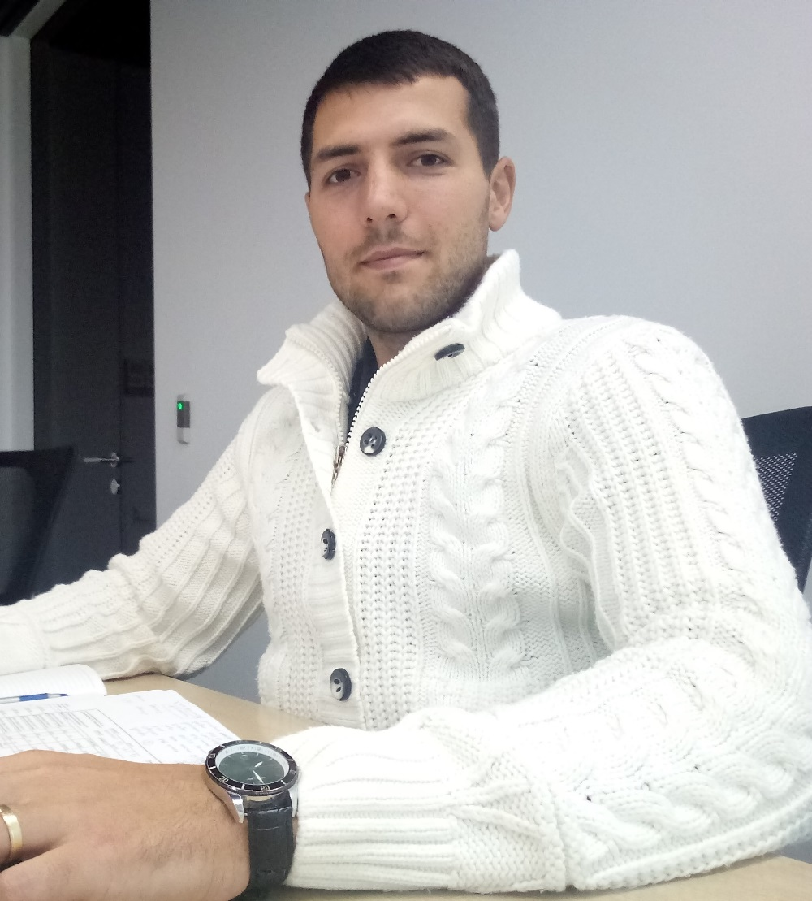

# 
Всем привет!

Я, **Бублик Константин Юрьевич**, родился 29 сентября 1991 года в Торезе, Донецкая обл., Украина. Отец учитель, мать и старший брат госслужащие.
- В 1998 году *пошел в 1-й класс [Гимназии](https://vk.com/gimnaziyatorez), которую хорошо закончил в 2008.*
- C 2008 года *учился в [Донецком государственном университете управления](https://donampa.ru/) на факультете экономики. За время учебы получил много наград за достижения в учебе и активном участии жизни университета.*
- В 2013 году *началась моя трудовая деятельность. Летом 2014 года я переехал Москву, где и живу сейчас.*
- В 2015 году *я женился, у нас есть сын, он ходит в [кадетскую школу](https://sch2121.mskobr.ru/).*

|Образование|Опыт работы|Достижения|Контакты|
|:---------:|:---------:|:--------:|:------:|
|1998-2008 гг. Гимназия, г.Торез|2013-2014 гг. продавец, Эльдорадо|2010 г. лучший староста на факультете|тел.: +79772703572|
|2008-2012 гг. ДонГУУ, логист, фак. Экономики|2014-2015 гг. супервайзер, Лидер-Тим|2011 г. благодарность от исолкома г. Донецка за вклад в озеленение города|e-mail: kostenn07@mail.ru|
|2012-2013 гг. ДонГУУ, менеджер, фак. Менеджмент|2015-2021 гг. супервайзер, Инканто|2011г. выход на повышенную стипендию|VK [Константин Бублик](https://vk.com/mr.kostet "Константин Бублик")|
|2022-н.вр. [Нетология](https://netology.ru/), Тестировщик|2021-2023 гг. менеджер, Алекс-Фитнес|2011 г. грамота за лучшую комнату в общежитии|Skype: mr.kot|

